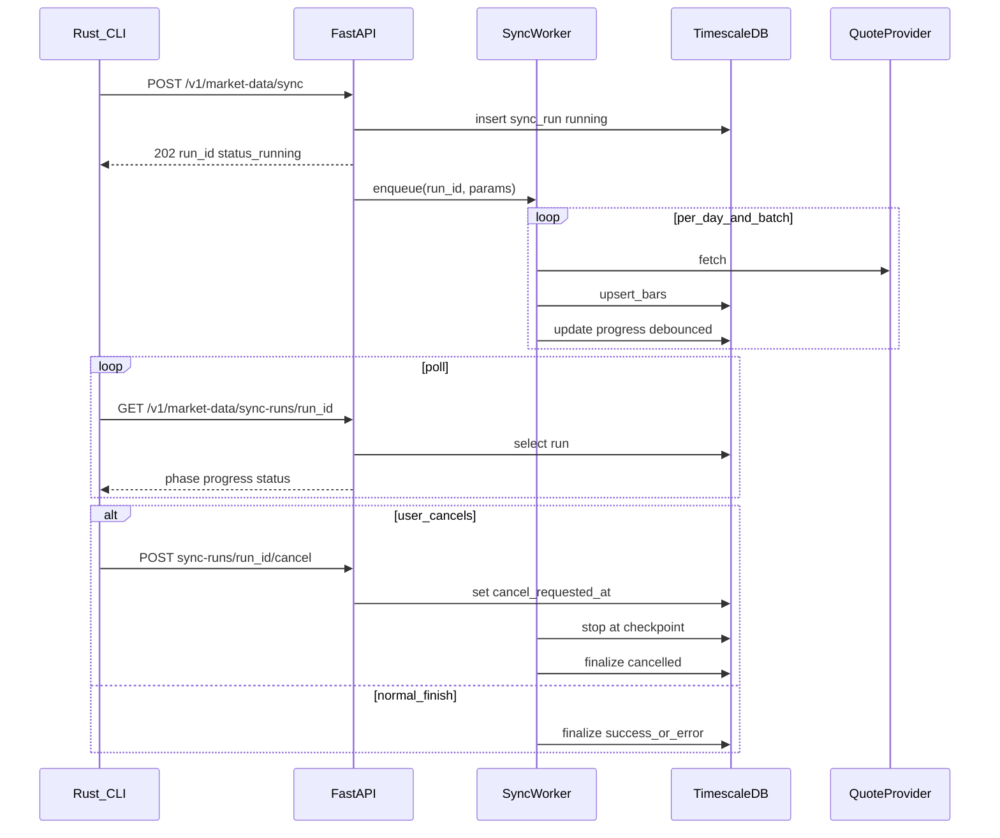

# L1 行情同步异步化设计

> 日期：2026-04-04  
> 状态：已确认  
> 前置：L1 Foundation Hardening（幂等、`sync_runs`、`checkpoint`、`GET /sync-runs` 已合入）  
> 范围：将 `POST /v1/market-data/sync` 与 `POST /v1/market-data/universes/sync` 从「单次长连接阻塞」改为「提交即返 + 后台执行 + 客户端轮询」，解决大标的池 × 长窗口下的 CLI/网关超时问题；并提供 **`POST /v1/market-data/sync-runs/{run_id}/cancel` 协作式终止** 与 CLI `sync cancel`（名称以实现为准）；以及 **标的级失败队列、可配置自动重试、失败次数与原因持久化、对失败标的的主动补拉**（见 §4.4、§5.6）。

---

## 1. 目标

### 1.1 问题

当前链路为：

- CLI 使用 `reqwest::blocking` 单次 `POST /v1/market-data/sync`，`timeout_ms` 覆盖**整次同步**。
- 服务端 [`SyncService.sync`](quant/src/application/market_data/sync_service.py) 在请求线程内按「交易日 × 标的」循环拉取并写库；Provider 侧多为**逐标的**请求。
- 大 scope（如 CSI300 × 180 天）必然超过合理 HTTP 超时，表现为 CLI `TransportError` 或服务端长时间占用 worker。

### 1.2 成功标准

- 提交同步后，HTTP 在**秒级内**返回（含 DB 写入 run 记录），不再依赖「整次同步在单次请求内完成」。
- CLI 可通过轮询获得**细粒度进度**（交易日进度、**当前处理到哪个标的**、**哪些标的已在本次任务意义上同步完、哪些仍待处理**、累计写入行数、失败明细、ETA）。标的维度定义见 §4.3。
- 支持**协作式终止**：客户端可请求取消指定 `run_id`，任务在**安全检查点**（如每个交易日批次之间）停止，并将 run 标记为已取消；**不**保证打断正在进行的单次 Provider HTTP 调用。
- **同一时间仅允许一个 running 的 bar sync job**；重复提交返回明确冲突（409），避免资源争抢与 DB/Provider 过载。
- 保留现有 **`request_id` 幂等**：**仅当**库中已有该 `request_id` 且 **`status=success`** 时短路返回摘要；若上次为 `failed` / `cancelled` / `interrupted`（或实现定义的其它非成功终态），**允许**用相同 `request_id` 再次提交新任务，避免「一次失败后永远无法重跑」。
- **意外中断后的续跑**：见下文「中断、恢复与续跑」；数据续拉依赖既有 **`sync_checkpoints`**，不要求复用同一 `run_id`。
- **标的拉取失败可恢复**：单次标的 × 日失败进入 **失败队列**；支持 **同 run 内自动重试**（有上限与退避）；**持久化失败次数、末次原因、末次失败交易日**，便于排障；任务结束后用户可通过 **专用入口** 仅对失败标的再发起一次异步同步（新 `run_id`，参数可从源 run 继承）。
- 无 DB 的 dev 路径（`_InMemoryBarStore`）可保持**同步内联**行为，避免引入无意义的后台线程。

### 1.3 明确不做（本期）

- 单日内 Provider **并发**拉取（多标的并行）——后续可在 Worker 内优化，不改变对外 API。
- 将 **CLI `config.toml` 的 `retry` 字段**自动用于 **Provider HTTP 客户端级**重试（与「标的级同步失败队列 / 同步服务重试」分离；后者见 §4.4，**本期纳入**）。
- **强制杀线程 / 进程级 SIGKILL 式终止**（无法保证 DB 与 checkpoint 一致性）；仅支持**协作式**取消。
- WebSocket/SSE 推送进度（仍以轮询为主）。
- 修改 `GET /v1/market-data/bars` 与 `GET /v1/market-data/sync-runs` 的**列表**语义（列表仍可展示 `running` 任务，可增字段）。

---

## 2. 方案选型结论

在「后台任务 + 轮询」「SSE」「CLI 分片多次 POST」中选定：

**后台任务 + 轮询（方案 A）**

- 与现有 `sync_runs` 表、`request_id` 设计一致。
- Rust CLI 仍以 `blocking` 为主：短超时 POST + 短超时 GET 轮询，无需引入全链路 async runtime。
- 契约清晰：202 提交、GET 查状态，易于测试与运维脚本对接。

---

## 3. 架构与数据流

### 3.1 序列概览



### 3.2 并发策略

- **串行**：进程内全局最多一个「bar sync」后台任务在执行；第二个 `POST /sync` 在已有 `running` 时返回 **409**，body 含 `running_run_id`（及可选 `code: SYNC_ALREADY_RUNNING`）。
- **Universe sync**：与 bar sync **共用**同一 Worker 互斥（或统一视为「market-data 写任务」），避免同时写 universe 文件与大量 bar 拉取；若需拆分可后续再定，本期以**单一互斥**为准。

### 3.3 分层约束（HiveFlow）

- **application**：`SyncService` 编排同步逻辑；新增 `SyncWorker`（或等价模块）仅做「后台线程 + 互斥 + 调用 application 用例」，**不**依赖 FastAPI。
- **interfaces/http**：路由只做 DTO 解析、依赖注入、HTTP 状态码与错误映射；**不写**拉数/写库业务循环。
- **infrastructure**：`TimescaleBarStore` 扩展读写 `progress` / `phase`；迁移 SQL 放 `quant/db/migrations/`。

---

## 4. 数据模型

### 4.1 迁移（新增列）

新迁移文件建议：`quant/db/migrations/0004_sync_runs_async.sql`（编号以仓库当前最大迁移为准）。

**`sync_runs` 新增列：**

- `sync_runs.progress`：`jsonb`，默认 `'{}'`。
- `sync_runs.phase`：`text`，默认 `'pending'`。
- `sync_runs.cancel_requested_at`：`timestamptz`，**默认 `NULL`**；非空表示已收到取消请求，Worker 在下一检查点结束任务并写入终态 `cancelled`。

**新建审计表 `sync_run_symbol_failures`**（同一迁移内）：详见 §4.4 持久化审计表，PK `(run_id, symbol)`。

### 4.2 `phase` 枚举（约定字符串）

建议取值（可扩展，需与查询侧文档一致）：

| phase | 含义 |
|-------|------|
| `pending` | 已建 run，尚未进入主循环 |
| `resolving_symbols` | 解析 symbols / universe / 默认 scope |
| `fetching` | 拉取 Provider 并写 bars |
| `finalizing` | 写 checkpoint、收尾、更新最终统计 |
| `success` | 终态（可与 `status` 重复表达，二选一为主对外字段） |
| `error` | 终态失败 |
| `cancelling` | （可选）已收到取消、正在收尾；也可仅用 `status=running` + `cancel_requested_at` 非空表达 |

**`status` 取值集合**（约定字符串，与 `phase` 分工）：

| status | 含义 |
|--------|------|
| `running` | 任务进行中 |
| `success` | 终态：全部完成 |
| `failed` | 终态：不可恢复的错误 |
| `cancelled` | 终态：用户协作式取消 |
| `interrupted` | 终态：进程崩溃/重启后由 startup 收口（见 §8.2） |

**分工**：`status` 表达「终态 / 运行中」；`phase` 表达「当前阶段细节」。终态时 `phase` 跟随 `status` 对齐或固定为最后阶段——实现计划中选一种并全仓统一，避免列表接口出现矛盾。

**取消终态**：`status = cancelled`；`error_code` 建议 `SYNC_CANCELLED`，`error_message` 可含可选原因；已写入的 bars **保留**（部分同步结果可审计）。

### 4.3 `progress` JSON 结构（详细进度）

满足「**同步到哪个标的**、**哪些标的已同步 / 哪些尚未**、per-symbol 错误明细 + ETA」需求，建议结构：

```json
{
  "total_symbols": 300,
  "total_rows_written": 12450,
  "current_day": "2026-03-15",
  "total_days": 180,
  "completed_days": 90,
  "current_symbol": "600519.SH",
  "symbols_done_for_run": ["000001.SZ", "000002.SZ"],
  "symbols_pending_for_run": ["600519.SH", "600036.SH"],
  "symbols_done_count": 145,
  "symbols_pending_count": 155,
  "symbol_lists_truncated": false,
  "elapsed_seconds": 45.2,
  "estimated_remaining_seconds": 48.1,
  "symbol_errors": [
    {
      "symbol": "000001.SZ",
      "day": "2026-03-10",
      "error": "provider timeout"
    }
  ],
  "failure_queue_depth": 12,
  "terminal_failed_symbols_count": 3
}
```

#### `progress` 顶层字段一览（含备注）

| 字段 | 类型 | 必填 | 备注 |
|------|------|------|------|
| `total_symbols` | `integer` | 建议 | 本 run 有效标的总数（解析 `symbols` / `universe` / default 之后）。 |
| `total_rows_written` | `integer` | 建议 | 本 run 已累计 `upsert` 的 bar 行数（含冲突更新）。 |
| `current_day` | `string`（`YYYY-MM-DD`） | 可选 | 外层按日循环**当前或最近处理的交易日**；`resolving_symbols` 阶段可为 `null`。 |
| `total_days` | `integer` | 建议 | 本次请求窗口内交易日总数（与 `days`/`end_date` 一致）。 |
| `completed_days` | `integer` | 建议 | 已完全处理完的交易日数量（实现定义：该日对所有待拉标的已 fetch/跳过）。 |
| `current_symbol` | `string` \| `null` | 可选 | 当前聚焦或批次内刚处理的标的；见下「细项说明」。 |
| `symbols_done_for_run` | `string[]` | 可选 | 本 run 窗口内**已同步完**的标的代码列表（**可能被截断**，见 `symbol_lists_truncated`）。 |
| `symbols_pending_for_run` | `string[]` | 可选 | 本 run 窗口内**尚未同步完**的标的代码列表（**可能被截断**）。 |
| `symbols_done_count` | `integer` | 建议 | 本 run 窗口内**已同步完**的标的真实个数（列表截断时仍以本字段为准）；**权威进度计数**，不另设 `completed_symbols` 别名。 |
| `symbols_pending_count` | `integer` | 建议 | 本 run 窗口内**尚未同步完**的标的真实个数。 |
| `symbol_lists_truncated` | `boolean` | 建议 | `true` 表示上述两列表仅保留字典序前 **N** 条（见 §4.3 列表体积上限）。 |
| `elapsed_seconds` | `number` | 可选 | 自本 run `started_at`（或 Worker 实际开工时刻）起的已用墙钟秒数。 |
| `estimated_remaining_seconds` | `number` \| `null` | 可选 | ETA；**非承诺**；样本不足时可 `null`。 |
| `symbol_errors` | `object[]` | 可选 | 最近若干条「按日按标的」的**原始错误痕迹**（展示/审计用）；**不**等同于失败队列驱动重试，见 §4.4。 |
| `failure_queue_depth` | `integer` | 可选 | 当前仍待在**同 run 内重试**的队列项数量（摘要）；详情见 §4.4 `failure_queue`。 |
| `terminal_failed_symbols_count` | `integer` | 可选 | 已达**超过最大重试次数**、本 run 内不再自动重试的标的个数（摘要）；与 `retry-failed` 候选集合相关，见 §4.4。 |

#### `symbol_errors[]` 元素字段（含备注）

| 字段 | 类型 | 必填 | 备注 |
|------|------|------|------|
| `symbol` | `string` | 是 | 标的代码，如 `600519.SH`。 |
| `day` | `string`（`YYYY-MM-DD`） | 建议 | 发生失败时所对应的交易日（与外层 `as_of` 对齐）。 |
| `error` | `string` | 建议 | 可读错误摘要（宜截断，如 ≤500 字符）；细码可另增 `error_code` 字段（可选扩展）。 |

#### 字段细项说明（与上表互补）

- **`current_symbol`**：本轮任务**当前聚焦的标的**（或 Provider 批次内**刚处理完 / 正在处理**的标的）。按日批量 `fetch` 时，在每个**自然检查点**（如每个 `as_of` 批次开始/结束、或 adapter 逐标的回调时）更新；**允许为 `null`**（例如在 `resolving_symbols` 阶段）。
- **`symbols_done_for_run` / `symbols_pending_for_run`**：在本 run 的**有效窗口**内，依据「是否仍需要对该标的拉取」划分的两类集合（见下 **「已同步 / 未同步」语义**）。用于进度展示与运维排查。
- **`symbol_errors`**：累积列表，**注意体积**；可设上限（如最近 50 条）并在文档中说明，避免 jsonb 过大。

（**失败队列体 `failure_queue[]`、自动重试与审计表**见 **§4.4**。）

#### 「已同步 / 尚未同步」（`symbols_done_for_run` / `symbols_pending_for_run`）语义

与**外层按交易日循环、内层按标的拉取**的实现对齐，定义**针对本 run 请求窗口**：

- **尚未同步（pending）**：在**当前 run 已推进到的进度**下，该标的对于窗口内**至少一个**仍待处理的 `as_of`，仍可能被拉取（尚未被本 run 跳过或写满覆盖）。即「本 run 还没把它在整个窗口上办完」。
- **已同步（done）**：对于本 run 的有效窗口，该标的**已不需要再拉**：要么历史 **checkpoint** 已覆盖剩余日期，要么本 run 已写入/跳过至窗口末端（实现上与 `checkpoint_starts[symbol]` 及循环终止条件一致）。

**说明**：这是**任务进度语义**，不等价于「数据库里该标的是否已有全历史数据」。Universe-only 等非 bar 任务可用空列表或单独字段（实现计划约定）。

#### `progress` 与持久化 `sync_checkpoints` 的关系

- **`sync_checkpoints` 表**：持久化「每个标的 + timeframe 的最后 bar 时间」，用于**跨 run 增量**（见 §8）。
- **`progress` JSON**：描述**当前这一次 run 执行到哪里**、**哪些标的在本 run 视角已完/未完**，便于 API/CLI 展示；**不替代** checkpoint 表。异步实现中应在 **cancel / 周期性 on_progress / 成功结束** 等时机尽量 **flush checkpoint**（见实现计划），使「进度里已 done」与落库进度尽量一致。

#### 列表体积上限

`symbols_done_for_run` / `symbols_pending_for_run` 在标的很多（如 `all_a`）时会导致 `jsonb` 过大。必须：

- 同时提供 **`symbols_done_count` / `symbols_pending_count`**（始终完整）；
- 列表仅保留**字典序**前 **N** 条（如 `N=200`，实现计划写死可调常量），超出则 `symbol_lists_truncated=true`；
- 可选后续：`GET .../sync-runs/{run_id}?symbol_lists=none|summary|full`（**本期可选**，未做则仅 summary + 计数）。

### 4.4 失败队列、自动重试与失败审计

#### 目标

- 某标的在某交易日拉取失败（空数据、Provider 异常、超时等）时，**不丢失上下文**：进入 **失败队列**，并记录 **第几次失败**、**原因摘要**（含 `as_of` / `day`）。
- 同一次 run 内：按策略 **自动重试** 队列中标的（避免无限重试压垮 Provider）。
- run 结束后：运维/用户可 **只对仍失败的标的** 再开任务（新 run），无需手工拼 symbol 列表。

#### 失败队列（逻辑结构）

- 内存 + **随 `progress` 持久化**（便于轮询展示）：`progress.failure_queue` 为对象数组；列表长度有上限，超出则依赖 `failure_queue_depth` 摘要 + 审计表。
- **与** `symbol_errors`（仅日志式累积）**区分**：`failure_queue` 驱动 **重试调度**；`symbol_errors` 仍可保留最近 N 条原始痕迹。

##### `failure_queue[]` 元素字段（含备注）

| 字段 | 类型 | 必填 | 备注 |
|------|------|------|------|
| `symbol` | `string` | 是 | 待重试或曾失败的标的。 |
| `day` | `string`（`YYYY-MM-DD`） | 建议 | 失败对应的交易日；批量失败且无法拆到单标的时允许多笔同 `symbol` 不同 `day` 或共用占位策略（实现计划写死）。 |
| `enqueued_at` | `string`（ISO-8601） | 可选 | 入队时间，便于排序与排查。 |
| `reason_code` | `string` | 建议 | 短码，与审计表 `last_error_code` 对齐，如 `PROVIDER_TIMEOUT`、`EMPTY_ROWS`、`RUNTIME_ERROR`。 |
| `reason_message` | `string` | 可选 | 截断后的可读原因，与审计表 `last_error_message` 对应。 |
| `attempts_in_run` | `integer` | 可选 | 本 run 内该 `(symbol, day)`（或该队列项）已尝试次数；达 `MAX_SYMBOL_ATTEMPTS` 后该项应出队并计入 terminal。 |

示例：

```json
"failure_queue": [
  {
    "symbol": "000001.SZ",
    "day": "2026-03-10",
    "enqueued_at": "2026-04-04T08:01:02+00:00",
    "reason_code": "PROVIDER_TIMEOUT",
    "reason_message": "urlopen timed out",
    "attempts_in_run": 2
  }
]
```

#### 同 run 自动重试策略（建议默认，实现可配置常量）

- **最大尝试次数** `MAX_SYMBOL_ATTEMPTS`（如单标的单 run 内合计 **3** 次，含首次）；超过后从队列移出，标记为 **`terminal_failed`**，写入审计表。
- **退避**：两轮重试之间 **sleep** 或推迟到「主循环日序结束后的 retry pass」（实现计划二选一，避免在热路径硬阻塞过久）。
- **粒度**：以 **(symbol, day)** 或「该日在该标的上的 fetch 单元」为最小重试单位（与当前 `quote_repo.fetch(symbols, as_of, ...)` 可拆分程度一致；若 adapter 仅支持批量，则整批失败整批重试，仍在审计里按标的记原因）。

#### 持久化审计表（推荐，便于 SQL 排查）

新建表（名称以实现为准，迁移与 `sync_runs` 关联）例如 **`sync_run_symbol_failures`**：

| 列 | 含义 |
|----|------|
| `run_id` | 关联 `sync_runs.run_id` |
| `symbol` | 标的 |
| `attempt_count` | 该 run 内对该标的（或对该 symbol×timeframe 窗口）累计尝试次数 |
| `last_error_code` | 短码，如 `PROVIDER_TIMEOUT` / `EMPTY_ROWS` |
| `last_error_message` | 截断后的可读信息 |
| `last_failed_day` | 最近失败的交易日 `YYYY-MM-DD` |
| `first_failed_at` / `last_failed_at` | 时间戳 |

- 每次失败 **UPSERT** 更新计数与 last_*；成功写入 bars 后可 **清除或降低**该 run 下该标的的 open 失败状态（实现计划写清）。
- 可选 **`sync_run_symbol_failure_events`** 追加型事件表（**本期可选**）：保留最近 K 条/每 symbol 最近 M 条，用于「历史原因」钻取；若不做，则在 `progress` 内保留 **每标的最近若干条** `reason` 快照。

#### 主动「只同步失败标的」

- **推荐 API**：`POST /v1/market-data/sync-runs/{run_id}/retry-failed`  
  - **前置**：源 `run_id` 为 **已结束**（`success` / `failed` / `cancelled` / `interrupted` 等，实现白名单）；从中读取 **审计表 +/或 终态 `progress` 中的 terminal 失败集合** 得到 symbol 列表。  
  - **行为**：入队 **新** 异步 bar sync（**新 `run_id`**），`symbols` = 上述集合；`days` / `end_date` / `timeframe` **默认继承源 run**（请求体可显式覆盖）。  
  - **响应**：与其它 sync 一致 **202**（或 409 若已有 running）。  
- **等价路径**：`POST /v1/market-data/sync` body 增加可选 **`retry_from_run_id`**，语义与上相同（实现可选二选一或两者并存，计划写死一种对外契约）。

#### CLI（建议）

- `hf data sync retry-failed --from-run-id <UUID> [--days ...] [--end-date ...] [--no-wait] ...`：调用上述 API，再进入轮询（与常规模板一致）。

#### 与 `request_id` 幂等

- **retry-failed 产生的新 run** 应使用 **新的 `request_id`**（或由客户端传入新 id）；**勿**与源 run 的 `request_id` 复用为同一成功幂等键，除非显式设计「同一补拉键」（不推荐）。

---

## 5. HTTP API

### 5.1 `POST /v1/market-data/sync`

| 场景 | 建议状态码 | body 要点 |
|------|------------|-----------|
| 新任务已入队 | **202** | `run_id`, `status: running`（或 `accepted`） |
| 已有任务执行中 | **409** | `code: SYNC_ALREADY_RUNNING`, `running_run_id` |
| `request_id` 命中已成功 run | **200** | 与现网「直接返回摘要」一致，避免无意义二次排队 |
| `request_id` 命中**运行中** run | **200** 或 **202** | 返回同一 `run_id`（实现计划中选定并文档化） |
| 参数错误 | 422 | 保持现有 `MARKET_DATA_EMPTY` 等 |
| Provider 不可用（提交阶段即失败） | 503 | 仅当提交前检查即失败；主流程错误在后台写 `sync_runs` |

### 5.2 新增 `GET /v1/market-data/sync-runs/{run_id}`

- 返回单条 run：**含** `phase`、`progress`、`cancel_requested_at`（若实现列）、原有 `status`、`written_rows`、`error_*` 等。
- 不存在：**404**。

### 5.3 新增 `POST /v1/market-data/sync-runs/{run_id}/cancel`（终止任务）

**语义**：协作式取消。服务端将对应 run 标记为「已请求取消」；Worker 在**下一检查点**（与 `on_progress` / 日批次边界对齐）停止拉数，进入收尾并更新 `sync_runs` 为 **`status=cancelled`**。

| 场景 | 建议状态码 | body 要点 |
|------|------------|-----------|
| `run_id` 存在且 `status=running` | **200** | `run_id`, `cancel_accepted: true`，可选 `status: cancelling` |
| `run_id` 不存在 | **404** | `code: SYNC_RUN_NOT_FOUND` |
| 已为终态（`success` / `failed` / `cancelled`） | **200** | **幂等**：`cancel_accepted: false`, `message: already finished`，带当前 `status` |
| 无 DB / 非异步路径 | **501** 或 **503** | 与「未启用后台同步」说明一致 |

**约束**：

- **不**中断正在执行的单次 `quote_repo.fetch`；最坏延迟 ≈ 单次 Provider 超时。
- 重复调用 cancel：**幂等**，不报错。
- Universe sync 若也使用同一 `sync_runs` 记录模型，则**同一 cancel 接口**适用；若 universe 使用独立 run 类型，路由或 `job_type` 字段需在实现计划中区分（本期建议**统一 run 表 + `job_type` 可选**，或 universe 与 bar 共用 `run_id` 语义）。

### 5.4 `POST /v1/market-data/universes/sync`

- 与 bar sync **同一异步模型**：202 + `run_id`，后台写 universe 文件；冲突时 409。
- 若 universe 拉取通常较快，仍统一为异步，避免「偶发慢请求」再次踩超时。

### 5.5 `GET /v1/market-data/sync-runs`（列表）

- 行为保持：可增返回字段 `phase`、`progress`、`cancel_requested_at`（或 progress 摘要），**不**改变过滤参数语义。
- `status` 过滤需支持 `cancelled`（若列表查询已有 `status` 参数）。

### 5.6 `POST /v1/market-data/sync-runs/{run_id}/retry-failed`（仅补拉失败标的）

- **语义**：见 §4.4；对**已结束**源 run 解析失败标的集合，创建**新**异步同步任务。
- **404**：`run_id` 不存在。
- **422**：源 run 仍在 `running`、或无可重试标的、或参数非法。
- **202** / **409**：与普通 `POST /sync` 一致。

---

## 6. CLI 行为

### 6.1 `hf data sync`

1. **POST** `/v1/market-data/sync`，提交阶段使用**较短**超时（如 10s），与「整次同步」解耦。
2. 若 **202**：进入轮询循环：
   - **GET** `/v1/market-data/sync-runs/{run_id}`，间隔默认 **1500ms**（可配置）。
   - 使用 `indicatif` 展示进度条/ETA；展示 **`current_symbol`**、**已同步/待同步数量**（来自 `symbols_*_count`）；在 **`--verbose`** 或 `table` 输出模式下展示 **`symbols_done_for_run` / `symbols_pending_for_run` 截断列表**（与 API 截断策略一致）。
3. 若 **200**（幂等命中）：直接输出最终 JSON（与现行为一致）。
4. 若 **409**：提示已有任务及 `running_run_id`，建议用户 `data query` 或等待。
5. **Ctrl+C**：进程退出前打印「服务端仍在执行」及 `run_id`，便于后续查询；可选后续增强为**自动调用 cancel**（需显式 flag，避免误杀他人任务，见实现计划）。

### 6.1.1 `hf data sync cancel`（建议）

- 参数：`--run-id <UUID>`（必填），`--timeout-ms`（调用 cancel API 的超时）。
- 行为：`POST /v1/market-data/sync-runs/{run_id}/cancel`，将 stdout 包装为现有 CLI JSON 信封（与仓库 `CLI_OUTPUT_SCHEMA` 一致）。
- 成功后用户可继续 `hf data query --request-id ...` 或按 `run_id` 查询直至 `status=cancelled`。

### 6.1.2 `hf data sync retry-failed`（建议）

- 参数：`--from-run-id <UUID>`（必填）；可选 `--days`、`--end-date`、`--timeframe` 覆盖继承值；`--no-wait` / 轮询与 §6.1 一致。
- 行为：调用 `POST /v1/market-data/sync-runs/{run_id}/retry-failed`（或等价 `POST /sync` + `retry_from_run_id`，以实现为准）。

### 6.2 新增参数（建议）

- `--no-wait`：仅提交，打印 `run_id` 后退出。
- `--poll-interval-ms`：默认 `1500`。
- `--timeout-ms`：**语义调整**为「客户端愿意等待的总时长（轮询+提交）」或保留为「单次 HTTP 超时」并另增 `--wait-timeout-ms`——**实现计划与 CLI help 中必须写死一种**，避免与现网配置冲突。

### 6.3 `hf data universe-sync`

- 与 `data sync` 对齐：提交 + 轮询 + `--no-wait`。

---

## 7. 进程生命周期

- FastAPI `startup`：创建**单例** `SyncWorker`，挂到 `app.state`；**对孤儿 run 做恢复**（见第 8 节）。
- `shutdown`：尽量等待当前任务结束（带**上限**，避免部署卡死）；超时则记录日志并退出进程（行为在实现计划中写明）。

---

## 8. 中断、恢复与续跑

### 8.1 用户关心的「续上次」分两层

| 层次 | 含义 | 本期行为 |
|------|------|----------|
| **数据续拉** | 已写入的 bars / checkpoint 不丢，下次少拉或跳过已覆盖区间 | **支持**。沿用现有 [`SyncService.sync`](../../../quant/src/application/market_data/sync_service.py) 的 **`sync_checkpoints` + 增量窗口**：再次发起 **相同 scope**（同一 `timeframe`、同一批标的来源、`end_date`/`days` 仍覆盖目标区间）的 `POST /sync` 时，从未覆盖的日期继续拉取，**无需**与上次任务共用 `run_id`。 |
| **作业记录续跑** | 同一个 `run_id` 在崩溃后由 Worker「接着上次的进度条」继续执行 | **不作为默认能力**。崩溃 / SIGKILL / OOM 后进程内线程丢失；若 DB 中 `sync_runs.status` 仍为 `running`，会形成**孤儿 run**，阻塞新的串行提交（409）或误导监控。 |

### 8.2 孤儿 `running` run 的恢复（必做）

进程 **startup**（在 Worker 接受新任务前）应对所有 `status=running` 的行做一次**收口**（任选一种语义，实现计划写死一种）：

- **推荐**：将孤儿 run 更新为 **`status=interrupted`**（或 `failed`），`error_code` 如 `SYNC_ORPHAN_RUN`，`finished_at=now()`，并清空或保留 `progress` 供审计。
- 收口后，用户可**重新 `POST /sync`** 启动**新** `run_id`；数据侧仍由 checkpoint **自动续拉**。

若希望区分「管理员主动停服」与「崩溃」，可后续增加 `last_heartbeat` 列（**本期可选**，未列入必做时可放入「明确不做」）。

### 8.3 `request_id` 与重试

- **成功幂等**：同 `request_id` 且已成功 → 直接返回摘要（同步 200 或异步查询均可），不重复拉数。
- **失败 / 取消 / 中断后重试**：同 `request_id` **不得**永久短路为成功；应允许新 run（或显式返回 409 提示用户换 `request_id`——**不推荐**，易困惑）。**推荐**：仅 `success` 短路，其它终态等同「未占用」，可再次提交。

### 8.4 不做（本期）

- 独立 API：`POST /v1/market-data/sync-runs/{run_id}/resume` 在同 `run_id` 上恢复线程（复杂度高，且与 checkpoint 续拉收益重叠）。
- 跨进程分布式锁（多副本部署下串行）——单进程串行 Worker 前提不变。

---

## 9. 测试与门禁

- **Python**：`SyncWorker` 串行与 409 条件、`SyncService` 带 progress 回调的循环（mock store/repo）；**cancel**：在检查点退出并写入 `cancelled`；**progress**：断言 `current_symbol`、`symbols_*_count` 与截断列表、`symbol_lists_truncated` 行为；**失败队列与重试**：mock Provider 失败 N 次后成功、断言 `attempt_count` 与审计表 UPSERT；**retry-failed**：源 run 终态后新 run 仅含失败标的。
- **Contract**：202/409/GET 单条 run；**POST cancel** 200 幂等、404；轮询到 `cancelled` 终态；GET 单条 **`progress` 含标的维度字段**；**POST retry-failed** 422/202。
- **Rust**：mock server：202 → 轮询 → 终态；409；`--no-wait`；**sync cancel** 成功与幂等；轮询 UI/verbose 能消费 `symbols_done_for_run` / `symbols_pending_for_run`（或计数）；**sync retry-failed** 提交流程。
- 合入前：`make architecture-check` 与 `make check`。

---

## 10. 追溯与审批

- 本 spec 经确认后，配套实现计划见：[`docs/superpowers/plans/2026-04-04-l1-async-sync-implementation-plan.md`](../plans/2026-04-04-l1-async-sync-implementation-plan.md)。
- 若 HTTP 响应形状或 CLI 包装 JSON 有破坏性变更，须按仓库契约流程更新 `docs/CLI_OUTPUT_SCHEMA.json`、`docs/CLI_OUTPUT_EXAMPLES.md` 与 fixtures，并跑 `make validate-cli-output`。

---

## 11. 参考路径（当前实现）

- 同步编排：[`quant/src/application/market_data/sync_service.py`](../../../quant/src/application/market_data/sync_service.py)
- 路由：[`quant/src/interfaces/http/routes_market_data.py`](../../../quant/src/interfaces/http/routes_market_data.py)
- 存储：[`quant/src/interfaces/adapters/market_data/timescale_bar_store.py`](../../../quant/src/interfaces/adapters/market_data/timescale_bar_store.py)
- CLI：[`cli/src/application/handlers/data_sync.rs`](../../../cli/src/application/handlers/data_sync.rs)、[`cli/src/infrastructure/http_client.rs`](../../../cli/src/infrastructure/http_client.rs)
